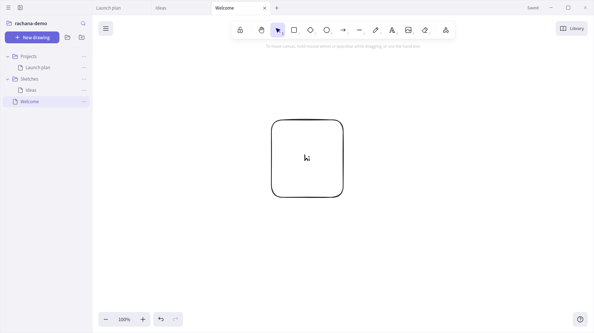

# Rachana (రచన)

**A private, local-first workspace for ideas and visual canvases.**

Rachana means writing, composition, and creation. Today, the app provides a polished desktop workspace for local `.excalidraw` files. Its product direction extends the same file-first workflow to Markdown, notes, and documents without moving personal work into a hosted service.



## Current capabilities

- Native Tauri desktop shell for Linux and macOS
- Local folder workspaces with a compact, resizable file tree
- Lazy-loaded Excalidraw editor with self-hosted handwritten and multilingual fonts
- Multiple document tabs with explicit saved, saving, conflict, and recovery states
- Buffered scene persistence and debounced autosave with disk-conflict detection
- Safe Save As handling with filesystem-aware collision protection
- File filtering that preserves folder context and keyboard navigation
- Light, dark, and system themes
- Presentation mode with a laser pointer
- Unified window chrome with accessible menus, tabs, and window controls

All drawings remain ordinary files in folders you choose.

## Development

### Prerequisites

- Node.js 24
- Current stable Rust toolchain
- Tauri 2 platform dependencies

On Ubuntu or Linux Mint:

```bash
sudo apt install \
  pkg-config \
  libdbus-1-dev \
  libwebkit2gtk-4.1-dev \
  libgtk-3-dev \
  libayatana-appindicator3-dev \
  librsvg2-dev
```

### Run

```bash
npm ci
npm run tauri -- dev
```

A browser-only Vite preview can render the interface, but native file and dialog actions require the Tauri process.

### Validate

```bash
npm run typecheck
npm run test:run
npm run test:coverage
npm run build
cargo fmt --manifest-path src-tauri/Cargo.toml -- --check
cargo test --manifest-path src-tauri/Cargo.toml --lib
```

Current frontend baseline: 24 test files, 145 tests, 69.18% statement coverage,
65.82% branch coverage, 78.00% function coverage, and 69.58% line coverage.

### Canvas performance

The Excalidraw SDK is loaded only when a drawing is opened. During editing, the
latest scene is buffered and full-document JSON serialization runs after 100 ms
of inactivity instead of on pointer-move frames. Save, Save As, tab lifecycle,
and workspace lifecycle paths flush pending scene data synchronously.

Use a production build when comparing responsiveness with excalidraw.com.
React and Excalidraw development builds intentionally include additional checks,
and a Linux Tauri window under WSLg uses a different webview and graphics stack
from a Windows browser.

### Build

```bash
npm run tauri -- build
```

Artifacts are written beneath `src-tauri/target/release/bundle/`.

## Keyboard shortcuts

| Action | Windows/Linux | macOS |
| --- | --- | --- |
| New drawing | `Ctrl+N` | `Cmd+N` |
| Open folder | `Ctrl+O` | `Cmd+O` |
| New folder | `Ctrl+Shift+N` | `Cmd+Shift+N` |
| Save | `Ctrl+S` | `Cmd+S` |
| Save As | `Ctrl+Shift+S` | `Cmd+Shift+S` |
| Toggle sidebar | `Ctrl+B` | `Cmd+B` |
| Close tab | `Ctrl+W` | `Cmd+W` |
| Switch tabs | `Ctrl+Tab` | `Cmd+Tab` |
| Presentation mode | `F5` | `F5` |
| Full screen | `F11` | `F11` |

## Architecture

- **Desktop runtime:** Tauri 2 and Rust
- **Interface:** React 19, TypeScript, and Vite
- **Canvas engine:** [`@excalidraw/excalidraw`](https://github.com/excalidraw/excalidraw)
- **State:** Zustand
- **Filesystem safety:** Rust-owned path validation and atomic writes with expected-content hashes, same-file identity checks, and serialized save transactions
- **Recovery:** external modifications and deleted-on-disk drawings remain explicit conflict/recovery tabs instead of being overwritten

Frontend coordination lives in `src/`; native commands, security checks, file
watching, and durable persistence live in `src-tauri/`. Repository-wide agent
rules live in `.github/copilot-instructions.md`, with path-specific guidance in
`.github/instructions/`.

## License

Rachana is licensed under the [Apache License 2.0](LICENSE).
